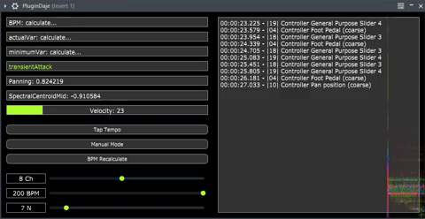
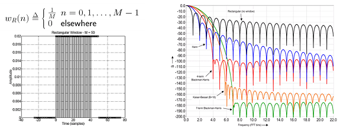
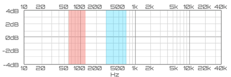
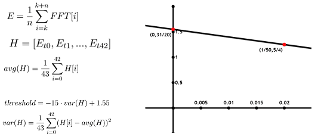
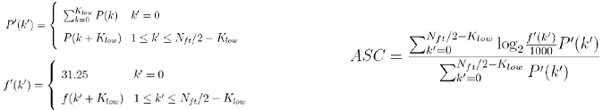
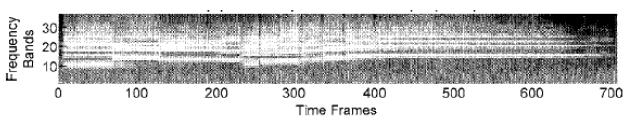
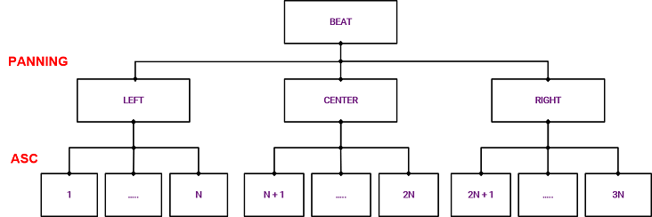

  

# 1. The concept

The goal of this project is the automated control of the dynamic lighting of an architectural structure composed by LED stripes: this is done by a plug-in which analyzes the mixer-output audio signal in real-time.

# 2. Plugin Interface

 

The Plug-in is all made by using the C++ JUCE application framework. 
# 3. The Algorithm

The Algorithm is based on few simples points:

- Beat detection frame by frame from the signal and the BPM calculus from it;
- Features extraction from the actual audio frame: audio panning, Audio Spectral Centroid (for audio "birghtness" calculation) and velocity (as an indicator of the audio intensity);
- Once features are extracted, a MIDI message created by a set of rules related to those characteristics is sent, in order to activate 3N possible light patterns.

##  3.1 Beat Tracking algorithm

The beat tracking algorithm is mainly based on a statistical model which use the energy content of the audio signal.

The first choise to make for the analysis of the audio frame is the window: the one chosen here is a rectangular one 1024 samples large with 0% overlap, to avoid latency problems and because we do not care a specific frequency tracking. The sampling frequency that we are considering is 44100 Hz.

  

Since this Plug-in is mainly thought for electro-music situations, we are mostly interested in a few range of frequencies: the choice has been made considering the "snare" [range]  and "kick" [range]  frequency range where we are sure to find the beat of interest.

  

For every 1024-samples frame we calculate the energy associated. Since we are analyzing 1024 samples of audio, to take 1 second history we need to store 43 blocks in an array and then calculate the average energy for that second. Then, every 1024 samples a threshold is calculated based on the variance of the "history energy array" calculated before and that is updated every 1024 samples to improve the real-time performances. If the difference of energy pass that certain threshold we can say there is a beat.

  

# 4. Feature extraction phase

Features' extraction is a crucial phase for what concern the rules for the choice of the lights' animations: this is made in real-time, frame by frame and independently from the beat-tracking algorithm.

##  4.1 Panning

The panning feature checks every 1024 samples the average energy content whithin each channel (Left and Right) to determine whether the signal is more present in one side with respect to the other. The energy is normalized between 0 and 1: subtracting the results of the  L-channel from the R-channel ones we can obtain different infos, -1 if the sound is completely panned to the left or 0 to the center or 1 to the right or among these values.

##  4.2 Audio Spectral Centroid

The audio spectral centroid (ASC) gives the center of gravity of a log-frequency power spectrum.

>Because the spectral centroid is a good predictor of the "brightness" of a sound it is widely used in digital audio and music processing as an automatic measure of musical timbre.

  

All coefficients below 62.5Hz are summed and represented by a single coefficient, in order to prevent a non-zero DC component and/or very low frequency components from having a disproportionate weight. 
_P'(k')_ is the modified spectrum, _f'(k')_ is the center of gravity of each element in the power-spectrum.

 
    <i>ASC example.</i>

##  4.3 Velocity

The velocity feature is thought for the management of the LED stripes' light intensity. As for the other features the calculus is done independently from the beat-tracking and parallel-wise, in order to optimize the real-time performance and reduce the latency. Once this feature is extracted, a midi message with this information is sent continuously to avoid a discrete variation of light intensity during the performance (stroboscopic effect). 
It is calculated considering the audio energy content in the low-frequency band in order to enhance the beat effect. Finally, the log-frequency scale is used to represent the frequency band distribution that are present in the human ear system.

.gif)  

# 5. Lights' animation 
For the choice of a given set of light patterns, we need a bunch of rules which depend on the feature extracted. 
##  5.1 Rules for animations' choice

Looking at the tree in the figure below, the path to follow is straightforward:  
&nbsp; &nbsp;1 - a beat is detected;  
&nbsp; &nbsp;2 - the panning value extracted is checked to be at left or center or right;  
&nbsp; &nbsp;3 - once the branch is chosen, depending on the value of the Audio Spectral Centroid (ASC) a given number of MIDI control message(in a range from 1 to 42 maximum per branch) is chosen to be sent to the lights' controller software. This message with that number will activate the corrisponding animation designed by the user. 

  

##  5.2 Animations management
In this section we look at the Animation Management part which is placed at the bottom of the interface: 

&nbsp; &nbsp;1 - The first command allows the user to choose among 16 different channels through which send the MIDI messages; 
&nbsp; &nbsp;2 - The second command allows the user to "slow down" the sending of the MIDI messages according to the beat. Indeed, if the song      currently playing had too quick four on the floors, this would lead to many animation changes over the time. 
&nbsp; &nbsp;3 - The third command allows the user to manually decide how many and what kind of animations activate. 

  

# 6.The rendering phase: 3D Mapper + Plugin 

# Live Performance on stage
