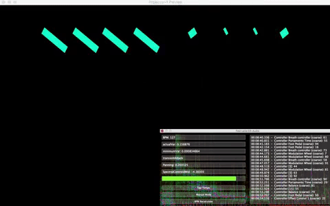
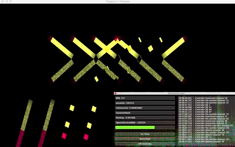

# The concept
The goal of this project is to automate the control of the lighting of an architectural structure composed by LED stripes in a dynamic and smart way, during an electronic music show.  
This is realized by a plug-in which analyzes the mixer-output audio signal in real-time and it communicates with a software which can handle the lights' animations thanks to the MIDI protocol.  

# Plugin Interface

The Plug-in is all made by using the C++ JUCE application framework and shows up like in the GIF below. 

  

# The Algorithm

The Algorithm is based on few simple points:

- **Beat tracking** frame by frame from the signal and the **BPM calculus** from it;
- **Features extraction** from the actual audio frame: audio panning, Audio Spectral Centroid (for audio "brightness" calculation) and velocity (as an indicator of the audio intensity);
- Once features are extracted, a MIDI message created by a set of rules related to those characteristics is sent, in order to activate 3xN possible **light patterns**, where N is the number of the available animations for each of the 3 sets of the brightness' value of the actual frame.

##  Beat Tracking algorithm

The beat tracking algorithm is mainly based on a statistical model which use the energy content of the audio signal.

The first choice to make for the analysis of the audio frame is the window: the one chosen here is a rectangular one 1024 samples large with 0% overlap, to avoid latency problems and because we do not care a specific frequency tracking. The sampling frequency that we are considering is 44100 Hz.

  

Since this Plug-in is mainly thought for electro-music situations, we are mostly interested in a few range of frequencies: the choice has been made considering the "snare" 300-750Hz  and "kick" 60-130Hz  frequency range where we are sure to find the beat of interest.

  

For every 1024-samples frame we calculate the energy associated. Since we are analyzing 1024 samples of audio, to take 1 second history we need to store 43 blocks in an array and then calculate the average energy for that second. Then, every 1024 samples a threshold is calculated based on the variance of the "history energy array" calculated before and that is updated every 1024 samples to improve the real-time performances. If the difference of energy pass that certain threshold we can say there is a beat.

  

## BPM calculus and interface's parameters  

The BPM calculus is done by considering the time differences among the beats that are intercepted by the algorithm. To keep it up to date, given the number of beats (after several tests it was decided to consider 13) the 12 differences of time in seconds between a beat and the other are inserted in a queue and the variance of these differences is calculated. Saved this value as the lowest variance found (*minimumVar*), as a beat is detected, a pop on the queue is done and then a new time difference is added. Then, the current variance (*actualVar*) is recalculated and it is compared with the one found previously: if it turns out lower then *minimumVar* it will be updated. The BPM then will be upgraded to a more faithful value, as it will mean that at that time the beats appear at more regular intervals. To calculate the BPM it will be necessary to divide 60 by the average of the differences present in the queue.

The indicator *transientAttack* indicates a period (10 seconds has been decided) where the waveform of the signal is too chaotic and so sudden power spikes lead to the detection of beats when they are not present. At the beginning then the indicator will be coloured green, after 10 seconds it will become white and the algorithm will be able to begin the calculations.

The *Manual mode* button is used as a substitute for the beat-tracker in case the algorithm does not detect the beats properly. It will finally be the task of the user to use the *Tap Tempo* button to reach the desired BPM: it’s necessary to point out that the *Tap Tempo* button replaces the beat-tracker, so every time it is pressed, the algorithm will continue to go forward by sending MIDI messages activating the desired animations.

The *BPM recalculate* button is used instead to restart the automatic calculation of BPM in the case in which between one song and the other the variance found is not lower than that one of the previous song (read again the calculation method of BPM). This would mean that the BPM would not be immediately updated with the true one.

## Feature extraction phase

Features' extraction is a crucial phase for what concern the rules for the choice of the lights' animations: this is made in real-time, frame by frame and independently from the beat-tracking algorithm.

###  Panning

The panning feature checks every 1024 samples the average energy content whithin each channel (Left and Right) to determine whether the signal is more present in one side with respect to the other. The energy is normalized between 0 and 1: subtracting the results of the  L-channel from the R-channel ones we can obtain different infos, -1 if the sound is completely panned to the left or 0 to the center or 1 to the right or among these values.

###  Audio Spectral Centroid

The audio spectral centroid (ASC) gives the center of gravity of a log-frequency power spectrum.

>Because the spectral centroid is a good predictor of the "brightness" of a sound it is widely used in digital audio and music processing as an automatic measure of musical timbre.

  

All coefficients below 62.5Hz are summed and represented by a single coefficient, in order to prevent a non-zero DC component and/or very low frequency components from having a disproportionate weight. 
_P'(k')_ is the modified spectrum, _f'(k')_ is the center of gravity of each element in the power-spectrum.

 
    <i>ASC example.</i>

###  Velocity

The velocity feature is thought for the management of the LED stripes' light intensity. As for the other features the calculus is done independently from the beat-tracking and parallel-wise, in order to optimize the real-time performance and reduce the latency. Once this feature is extracted, a midi message with this information is sent continuously to avoid a discrete variation of light intensity during the performance (stroboscopic effect). 
It is calculated considering the audio energy content in the low-frequency band in order to enhance the beat effect. Finally, the log-frequency scale is used to represent the frequency band distribution that are present in the human ear system.

  

# Lights' animation 

For the choice of a given set of light patterns, we need a bunch of rules which depend on the feature extracted. 

##  Rules for animations' choice

Looking at the tree in the figure below, the path to follow is straightforward:  
&nbsp; &nbsp;1 - a beat is detected;  
&nbsp; &nbsp;2 - the panning value extracted is checked to be at left or center or right;  
&nbsp; &nbsp;3 - once the branch is chosen, depending on the value of the Audio Spectral Centroid (ASC) a given number of MIDI control message(in a range from 1 to 42 maximum per branch) is chosen to be sent to the lights' controller software. This message with that number will activate the corrisponding animation designed by the user. 

  

##  Animations management

In this section we look at the Animation Management part which is placed at the bottom of the interface: 

&nbsp; &nbsp;1 - The first command allows the user to choose among 16 different channels through which send the MIDI messages; 
&nbsp; &nbsp;2 - The second command allows the user to "slow down" the sending of the MIDI messages according to the beat. Indeed, if the song      currently playing had too quick four on the floors, this would lead to many animation changes over the time. 
&nbsp; &nbsp;3 - The third command allows the user to manually decide how many and what kind of animations activate from N equal 3 to 42. 

  

# The rendering phase: 3D Mapper + Plugin 

  

  

The animations were created with 3D Mapper based on the LED system, their disposition to form a specific architecture and choices of the client. They will be interconnected to the 3n midi messages obtained with the tree structure and the velocity parameter, calculated on the audio input.

# Live Performance on stage

## References 

-Christian Barrio, «Beat Detection Algorithm», available at https://www.parallelcube.com/2018/03/30/beat-detection-algorithm/  
-Bruno Digiorgi, Massimiliano Zanoni, Sebastian Bock, Augusto Sarti, «Multipath Beat Tracking»  
-George Tzanetakis, Randy Jones, and Kirk McNally, «Stereo panning features for classifying recording production style  
-Fabio Antonacci, «An introduction to sound classification»  
-Augusto Sarti, «Sound Analysis Tools»  

## Software Developers Team

Davide Dal Cortivo  
Edoardo Epifani  
Carmelo Fascella  
Davide Gioiosa  
Davide Mori  
Francesco Pino  
